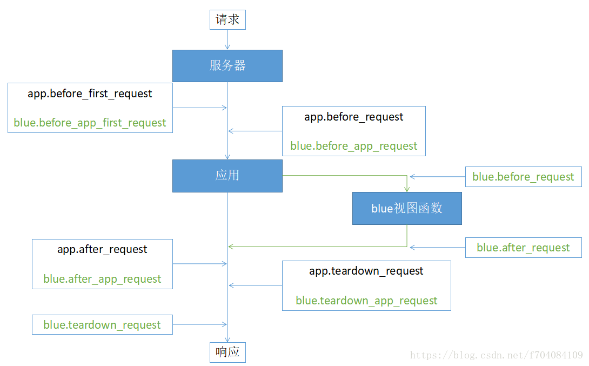
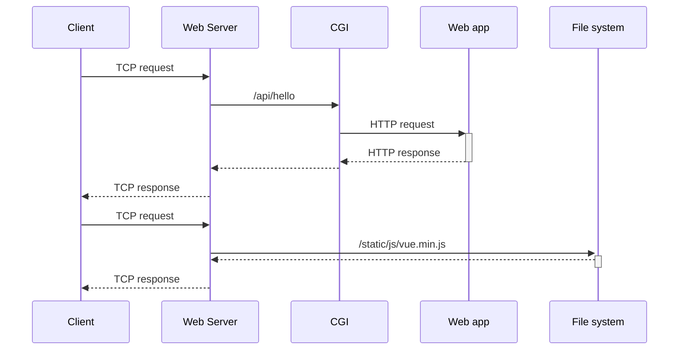

## Flask 知识


### 请求及响应

#### 响应体

响应体的写法非常灵活。以下是各种示例。

```python
def get(self):
  
    # 响应返回 200 text/html
    return 'hello world'
    return render_template('error.html')
    # 响应返回 200 application/json
    return {'a': 1} # 本质是 jsonify({'a': 1})
  
    # 3种简单定制，没有指定的信息，flask 自动补齐
    return 'foo', 200  # (response, status)
    return 'foo', {'server': 'hello'}  # (response, headers)
    return 'foo', 200, {'server': 'hello'} # (response, status, headers)
    # 用了 jsonify，是ContentType设为application/json。 仍然可以定制。
    return jsonify({'a': 1}), 400, {'server': 'hello'}
    return render_template('error.html'), 404, {'server': 'hello'}
  
    # 深入定制
    r = make_response("hello") #here you could use make_response(render_template(...)) too
    r.headers['Access-Control-Allow-Origin'] = '*'
    return r
```

#### 请求体

请求体的解析：request 对象和 Django 不太一样

```python
#  Django 是 显式传入 request 参数
from django.http import HttpResponse
from django.template import loader
from .models import Question
def index(request):
    latest_question_list = Question.objects.order_by('-pub_date')[:5]
    template = loader.get_template('polls/index.html')
    context = {'latest_question_list': latest_question_list,}
    return HttpResponse(template.render(context, request))

# Flask 是 使用了一个 框架全局变量 request 对象
from flask import request
def index():
    headers = request.headers
    return 'Client request headers: {}'.format(headers)
```

Flask 的 request 对象，是一个框架内部的全局变量，是一个上下文变量。Flask 有 4 个上下文变量：

```python
from flask import current_app, g, request, session

```

这 4 个上下文变量的实现，原理大致相同。实现非常复杂。

request 对象，有很多属性：

```python
from flask import request
def test():
    from typing import Callable
    attr = [i for i in dir(request) if not i.startswith('_')]
    return '<p>Callable: {}</p><p>Attribute: {}</p>'.format(
        [i for i in attr if isinstance(getattr(request, i), Callable)],
        [i for i in attr if not isinstance(getattr(request, i), Callable)]
    )
# 从浏览器就会看到，可以调用的对象有：
 ['application', 'close', 'dict_storage_class', 'form_data_parser_class', 'from_values', 'get_data', 'get_json', 'if_match', 'if_none_match', 'list_storage_class', 'make_form_data_parser', 'on_json_loading_failed', 'parameter_storage_class']
# 属性有非常多。可以分为几大类
		# 请求信息。环境信息，重要性不是特别大。
    "headers", "environ", # 请求信息，包括对方的请求头，自己服务器的相关信息。
    "accept_charsets", "accept_encodings", "accept_languages", "accept_mimetypes", "access_route", "cache_control", "pragma", "charset", "content_encoding", "content_length", "content_md5", "content_type", "max_content_length", "max_form_memory_size", "max_forwards", # 请求头Pragma等同于Cache-Control
    
		# 请求信息。比较重要。
    "user_agent", "scheme", "method", # // scheme是 http & https
    "cookies", 
    "args", "query_string", "data", "files", "form", "json",
    "remote_addr", "remote_user", "authorization",
    "base_url", "full_path", "host", "host_url", "path", "url", "url_charset", "url_root", "url_rule", "referrer",
		# 自己服务器的信息
    "blueprint", "endpoint",
		#  bool 类型的信息
    "if_modified_since",
    "if_range",
    "if_unmodified_since",
    "is_json",
    "is_multiprocess",
    "is_multithread",
    "is_run_once",
    "is_secure",
    "is_xhr",
    
    # 不知是什么
		"mimetype", "mimetype_params",
    "disable_data_descriptor",
    "encoding_errors",
    "range",
    "date",
    "input_stream",
    "routing_exception",
    "script_root",
    "shallow",
    "stream",
    "trusted_hosts",
    "values",
    "view_args",
    "want_form_data_parsed"
```

在上面的信息中，比较重要的有：

```python
# 请求头附带数据 headers、cookies、method、url
"query_string", # url 的查询字符串，比如 bing.com?a=1&b=2#123 中的 a=1&b=2
"args", # 将查询字符串解析成一个MultiDict。
"data", # 请求体 的原始二进制数据。
"files", # 上传文件，就解析到这里
"form",  # HTML 的 表单数据
"json",  # json 数据
```


### 会话：cookie、session、token

#### cookies

cookies的读取比较简单，是MultiDict对象，和字典一样，get不到值，就默认返回None

```python
from flask import request, make_response
@app.route('/')
def index():
    username = request.cookies.get('username', 'Anonymous') # 读取
    resp = make_response(render_template(...)) # jsonify() 也会产生 Response对象
    resp.set_cookie('username', 'the username')  # 设置。参数很多，看文档
    # set_cookie(key, value='', max_age=None, expires=None, path='/', domain=None, secure=False, httponly=False, samesite=None)
    # 删除cookie： response.delete_cookie('username')
    return resp
```

#### session

session 存储的方式有很多，可以存在 cookie、cache、redis/memcache、服务器端文件等等。除了第一种，其他的方式里，cookie 中一般只保存 session_id ，服务端从cookies读取  session_id，再根据 session_id获取存储在别处的 session信息。

- 全部保存在cookies里面。session信息会被 serialize 之后存到 cookie 里面（绝大多数情况都会加密），用户不知道序列化的加解密手段，无法直接篡改，安全性会大大提高。所以，不允许用户擅自修改的信息存到 session 之中，而无所谓用户修改不修改的内容则可以直接存到 cookie 中。
- cookies保存  session_id ，session信息存到其他地方。这样，每次只需要相互传送 session_id，并且服务端也只需要验证 session_id 的合法性，比较快捷。缺点是多个server 共享 session不好做。

flask默认的 session 实现是把 session信息加密处理过之后直接保存到 cookie 中（ 加密 itsdangerous），也叫客户端 session，并不是cookie只保存 session_id。如果要实现 cookie 中仅仅保存 session id，请使用 flask-session 扩展。

如果使用了 session，一定要设置`SECRET_KEY`，**不然会非常不安全**。

使用默认的 session 非常简单。也是是MultiDict对象，和字典一样使用。

```python
from flask import session
@app.route('/')
def index():
    uid = session.get('uid', None)
    if not uid:
        session['uid'] = 'AnonymousUser'
        # 删除某个session：session.pop('uid')
        # 删除所有session：session.clear() 
        session.permanent = True # 设置持久化，然后config 设置
    return 'hello world
# config.py
from datetime import timedelta
PERMANENT_SESSION_LIFETIME = timedelta(days=7)  #设置session7天有效
```

清理历史记录，第一次请求cookies没有session，响应时cookies就有一个key叫session，对应的值eyJ1aWQiOiJiYmIifQ.XUKAEg.SVdz3Fh-LOcgW-3u8Whaa-HNTGc，之后每个请求cookies里面都有session。

使用 其他方式的session，必须安装[Flask-Session](https://pythonhosted.org/Flask-Session/)，

```python
# 1. pip install redis Flask-Session # 安装 redis-py 和 Flask-Session

# 2. 需要设置一些值。https://www.jb51.net/article/153452.htm  官方文档有更详细的例子
SESSION_TYPE = 'redis' # session类型为redis
SESSION_PERMANENT = True # 如果设置为True，则关闭浏览器session就失效。
PERMANENT_SESSION_LIFETIME = timedelta(days=7) # from datetime import timedelta 
SESSION_USE_SIGNER = False # 是否对发送到浏览器上session的cookie值进行加密,默认False 
SESSION_KEY_PREFIX = 'flask-session' # 保存到redis中的key的前缀
SESSION_COOKIE_NAME = 'session_id'  # 保存在浏览器的cookie名称
SESSION_REDIS = redis.Redis(host='10.1.210.33',port='6379',password='123123')
#其他配置，不经常使用
SESSION_COOKIE_DOMAIN = '127.0.0.1' # 设置cookie的域名，不建议设置默认为server_name
SESSION_COOKIE_PATH = '/' # 会话cookie的路径。 如果未设置，则cookie将对所有url有效，默认为'/'
SESSION_COOKIE_HTTPONLY = True # 是否启动httponly,默认为true，为了防止xss脚本访问cookie

# 3. 并且，在app.run()前要进行初始化。
from flask_session import Session
Session().init_app(app)
```


#### Token

Token 和 微服务 之类的，留待以后研究。


### Flask 面向切面编程

#### 钩子函数（django的中间件）

面向切面编程 Aspect Oriented Programming(AOP)。Flask 提供的面向切面编程的工具，叫做钩子，很多钩子代表着不同的干预点。

> One of the design principles of Flask is that response objects are created and passed down a chain of potential callbacks that can modify them or replace them. 

1. before_first_request:在处理第一个请求前执行

2. before_request:在每次请求前执行

3. errorhandler：出现访问错误的时候运行。可以用它定制 404 页面，也可以用它记录访问错误的次数，次数过多，以后直接 reject。

4. context_processor：将一个字典推入到请求上下文中，之后就可以直接在请求上下文中使用。比如下面的代码，推入了`jidan`，就可以在jinja2的模版中直接引用{{jidan}}就会在页面显示yao。这样就不用在每个视图函数中都render_template中重复去写一次。

   ```python
   @app.context_processor
   def context_rocessor():
       return {'jidan':'yao'}
   ```

5. after_request:每次请求之后调用，前提是没有未处理的异常抛出

6. teardown_request:每次请求之后调用，即使有未处理的异常抛出

7. teardown_appcontext


在 Blueprint 层面，也有对应的钩子函数（几乎上面的每个钩子函数都有对应）。需要注意的是，它不仅能从 子模块 中干预，还能从整体 app 干预。最好不要在 Blueprint 层干预 app 层，这会造成 整体框架的结构设计混乱。

```python
blueprint = Blueprint('', __name__,)
@blueprint.before_app_first_request
def fun(): pass

@blueprint.before_app_request
def fun(): pass

@blueprint.before_request
def fun(): pass
```

app 与 blueprint 的钩子，作用流程大致如下。




#### 信号量 signal


### Flask 集成 ORM

Django中，ORM 不仅做到了在View里的CURD，还做到了在shell环境里探索 ORM 接口。在 flask 也可以做到类似的功能。

https://www.cnblogs.com/wupeiqi/articles/8259356.html

#### 初级：从model到view

##### 如何建立 model

和django类似，继承model类，然后写一个个的数据字段。不同的是，relationship比较复杂。

```python
from datetime import datetime
from utils.db_tool import db
class Question(db.Model):
    id = db.Column(db.Integer, primary_key=True)
    question_text = db.Column(db.String(200), nullable=False, comment='question text')
    pub_date = db.Column(db.DATETIME, nullable=False, default=datetime.utcnow,)

class Choice(db.Model):
    id = db.Column(db.Integer, primary_key=True)
    question_id = db.Column(db.Integer, db.ForeignKey('question.id'))
    question = db.relationship('Question', backref='choices') # 不是字段
    choice_text = db.Column(db.String(200))
    votes = db.Column(db.Integer(), default=18)
```

##### 如何在 django manage.py 迁移 ORM

```shell
$ python manage.py makemigrations
$ python manage.py migrate
```

##### 如何在 view 使用 model

```python
import datetime
import json
from flask import session, request, Response, jsonify, views
from .models import *

class QuestionListView(views.MethodView):
    def post(self):
        question_text = request.json.get('question_text', None)
        q = Question(question_text=question_text, pub_date=datetime.now())
        options = request.json.get('options', [])
        q.choices = [
            Choice(choice_text=i['choice'], votes=0) for i in options
        ]
        db.session.add(q); db.session.commit()
        return 'success'

    def get(self):
        questions = Question.query.all()  # ORM 查询
        res = {}
        for i in questions:
            res[str(i.id)] = {
                'question_text': i.question_text,
                'publish': i.pub_date.strftime("%Y-%m-%d %H:%M:%S")
            }
            res[str(i.id)]['options'] = [
                {'choice': c.choice_text, 'votes': c.votes}
                for c in i.choices  # 反向查询被谁引用，然后 迭代解析
            ]
        return json.dumps(res, ensure_ascii=False)
```

在外键关系中，查询和保存还算简单

|      | 正向                                                         | 反向                                                         |
| ---- | ------------------------------------------------------------ | ------------------------------------------------------------ |
| 查询 | c = Choice.first();  q=c.question                            | q=Question.first();   choices=q.choices                      |
| 存入 | c=Choice('先有鸡', question=Question(''));  db.session.add(c) | q = Question('');  q.choices=[Choice(), Choice()]; db.session.add(q) |

另外，URL最好做到符合 Restful 

| 请求类型 | 请求路径  | 功能             |
| -------- | --------- | ---------------- |
| GET      | /books    | 获取列表         |
| POST     | /books    | 创建一本书       |
| GET      | /books/id | 通过id查询一本书 |
| PUT      | /books/id | 通过id更新一本书 |
| DELETE   | /books/id | 通过id删除一本书 |

##### 如何在 shell 使用 model

```python
$ python manage.py ipython
In [1]: from apis.books.models import *
In [2]: from datetime import datetime
In [3]: q = Question('魔镜魔镜看看我,我的锁骨在哪里?', datetime.now())
In [5]: db.session.add(q)
In [8]: c = Choice(question_id=1, choice_text='没有锁骨', votes=0)
In [9]: db.session.add(c)
In [10]: c1 = Choice(question_id=1, choice_text='性感锁骨', votes=0)
In [11]: db.session.add(c1)
In [12]: db.session.commit()
```

#### 进阶：ORM关系


### log 设置及应用

与调试、追踪相关的工具包括 `print() logging  warnings`

| 情境                           | 情境                                       | 工具                |
| ------------------------------ | ------------------------------------------ | ------------------- |
| 打印到屏幕                     | 打草稿、unittest                           | print()             |
| 记录正常的操作                 | 运行正常，为了追查 BUG，及其所能记录详情   | logging.debug()     |
|                                | 运行正常，记录状态                         | logging.info()      |
| 发出警告（软件还能完成功能）   | 用户能够做出改变，所以发出警告督促用户改变 | warnings.warn()     |
|                                | 用户没法改变，但应该记录这种反常           | logging.warning()   |
| 抛出一个错误                   |                                            | 抛异常              |
| 记录错误（软件已无法完成功能） | 软件部分功能与预期相反                     | logging.error()     |
|                                | 发生运行Exception                          | logging.exception() |
|                                | 软件整体崩溃                               | logging.critical()  |

相应的 log 的级别是

| level    | usage                                    | method            |
| -------- | ---------------------------------------- | ----------------- |
| DEBUG    | 为了调试追踪，而记录详情（比较少用）     | logger.deebug()   |
| INFO     | 为了确认正常，而记录状态                 | logger.info()     |
| WARNING  | 出现反常情况，但软件功能依然能够正常实现 | logger.warning()  |
| ERROR    | 部分软件失效                             | logger.error()    |
| CRITICAL | 整个软件崩溃                             | logger.critical() |


### 部署

Flask 和 Django 以命令行启动的这种方式，仅用于开发，并不适合部署。

#### 通用的部署方案

常见的 Python Web APP 的部署结构如下：



常见的 Web Server 是 Nginx，解决 TCP 接入层的问题。Python的 CGI 一般称为 wsgi，常用的有uWSGI 和 Gunicorn，CGI 实现 TCP 到 HTTP 的转换。Python的常见Web App 是 Django、Flask、Sanic。

以 Nginx——Gunicorn——Flask为例，部署一个Python Web Service

激活 venv，安装 Gunicorn

```shell
$ conda env list # 看看venv列表
$ source activate && source deactivate # 如果无法激活 venv，尝试一下这条命令
$ conda activate python3.6   # 激活 venv 
$ pip freeze | grep gunicorn # 看看有没有安装 gunicorn，安装命令pip install gunicorn
```

在项目内部新建Gunicorn配置文件  schurz/gunicorn_conf.py

```python
import os
bind = '0.0.0.0:8000' # 绑定ip和端口号
backlog = 512         # 监听队列
# chdir = '/home/test/server/bin'  #gunicorn要切换到的目的工作目录
timeout = 30      # 超时。如果系统初始化时间很长，这个值必须比较大。否则启动一半，就被杀死重启
# worker_class = 'gevent' #使用gevent模式，还可以使用sync 模式，默认的是sync模式
workers = 1 # multiprocessing.cpu_count() * 2 + 1    #进程数
threads = 2 # 指定每个进程开启的线程数
reload = True
daemon = True # 后台运行（尝试调试部署的时候，可以前台运行）
loglevel = 'info' #日志级别，这个日志级别指的是错误日志的级别，而访问日志的级别无法设置
access_log_format = '%(t)s %(p)s %(h)s "%(r)s" %(s)s %(L)s %(b)s %(f)s" "%(a)s"'  # accesslog的格式
accesslog = os.path.join(os.path.dirname(os.path.dirname(__file__)),
                       'gunicorn_access.log')   # 访问日志文件
errorlog = os.path.join(os.path.dirname(os.path.dirname(__file__)),
                       'gunicorn_error.log')    # 错误日志文件
```

配置文件不仅仅可以写成 a.py 文件，还可以写成 a.conf 文件，语法都是Python语法，只是使用的时候最好指明路径 `gunicorn /path/to/a.config  schurz.wsgi:app`。

尝试使用 Gunicorn 启动项目

```shell
$ cd Schurz # 切换到工程目录
$ python manage.py runserver 0.0.0.0:8000 # 尝试一下能不能以debug模式启动，并且客户端能不能连接
$ gunicorn --config python:gunicorn_conf schurz.wsgi:app # 尝试一下，这种方式启动，能不能用客户端运行
# 很多情况下，需要指定 gunicorn 的绝对路径（不要预先激活venv，比如用 supervisor）
$ /opt/venv/bin/gunicorn --config python:gunicorn_conf schurz.wsgi:app # py格式的配置文件，用 python:a.b.c 读取
$ /opt/venv/bin/gunicorn --config ./gunicorn_conf.py schurz.wsgi:app # py格式的配置文件，也可以使用路径
# 指明 gunicorn 和 conf 的绝对路径
$ /opt/venv/bin/gunicorn --c /opt/venv/gun.conf schurz.wsgi:app
```

安装Nginx

```shell
$ sudo apt update && sudo apt-get install nginx
$ nginx -v
$ sudo systemctl status nginx # 查看状态
$ sudo systemctl stop nginx
$ sudo systemctl start nginx 
$ sudo systemctl restart nginx
$ sudo systemctl reload nginx # 在进行一些配置更改后重新加载Nginx服务
$ sudo systemctl disable nginx  # 禁止 Nginx服务 开机自启
$ sudo systemctl enable nginx  # 让 Nginx 开机自启
```

配置 Nginx

```shell

```

常用的服务器操作系统：CentOS、Ubuntu。

常用的 Web 服务器：Nginx、Apache。

常用的 WSGI 服务器：Gunicorn、uWSGI、CherryPy、Tornado、Gevent、mod_wsgi(Apache)。


##### Supervisor

安装

```shell
$ sudo su - #切换为root用户
$ yum install epel-release && yum install -y supervisor # CentOS 安装 supervisor
$ apt-get install -y supervisor # ubuntu 安装 supervisor


```

配置为开机启动

```shell
$ sudo su - #切换为root用户
$ systemctl enable supervisord # 开机自启动
$ systemctl start supervisord # 启动supervisord服务
$ systemctl status supervisord # 查看supervisord服务状态
$ ps -ef | grep supervisord # 查看是否存在supervisord进程
$ systemctl stop supervisord # 停止 supervisor
```

如果上面的命令执行失败，就尝试手动配置开机启动

```shell
$ vi /usr/lib/systemd/system/supervisord.service  # 加入下面的内容，再试试上面的代码
[Unit]
Description=Supervisor daemon

[Service]
Type=forking
PIDFile=/var/run/supervisord.pid
ExecStart=/bin/supervisord -c /etc/supervisord.conf
ExecStop=/bin/supervisorctl shutdown
ExecReload=/bin/supervisorctl reload
KillMode=process
Restart=on-failure
RestartSec=42s

[Install]
WantedBy=multi-user.target
```

配置


```
; Sample supervisor config file.
;
; For more information on the config file, please see:
; http://supervisord.org/configuration.html
;
; Notes:
;  - Shell expansion ("~" or "$HOME") is not supported.  Environment
;    variables can be expanded using this syntax: "%(ENV_HOME)s".
;  - Quotes around values are not supported, except in the case of
;    the environment= options as shown below.
;  - Comments must have a leading space: "a=b ;comment" not "a=b;comment".
;  - Command will be truncated if it looks like a config file comment, e.g.
;    "command=bash -c 'foo ; bar'" will truncate to "command=bash -c 'foo ".

[unix_http_server]
file=/var/run/supervisor.sock   ; the path to the socket file
;chmod=0700                 ; socket file mode (default 0700)
;chown=nobody:nogroup       ; socket file uid:gid owner
;username=user              ; default is no username (open server)
;password=123               ; default is no password (open server)

[inet_http_server]         ; inet (TCP) server disabled by default
port=127.0.0.1:9001        ; ip_address:port specifier, *:port for all iface
;username=user              ; default is no username (open server)
;password=123               ; default is no password (open server)

[supervisord]
logfile=/var/log/supervisord.log ; main log file; default $CWD/supervisord.log
logfile_maxbytes=50MB        ; max main logfile bytes b4 rotation; default 50MB
logfile_backups=10           ; # of main logfile backups; 0 means none, default 10
loglevel=info                ; log level; default info; others: debug,warn,trace
pidfile=/var/run/supervisord.pid ; supervisord pidfile; default supervisord.pid
nodaemon=false               ; start in foreground if true; default false
minfds=1024                  ; min. avail startup file descriptors; default 1024
minprocs=200                 ; min. avail process descriptors;default 200
;umask=022                   ; process file creation umask; default 022
;user=chrism                 ; default is current user, required if root
;identifier=supervisor       ; supervisord identifier, default is 'supervisor'
;directory=/tmp              ; default is not to cd during start
;nocleanup=true              ; don't clean up tempfiles at start; default false
;childlogdir=/tmp            ; 'AUTO' child log dir, default $TEMP
;environment=KEY="value"     ; key value pairs to add to environment
;strip_ansi=false            ; strip ansi escape codes in logs; def. false

; The rpcinterface:supervisor section must remain in the config file for
; RPC (supervisorctl/web interface) to work.  Additional interfaces may be
; added by defining them in separate [rpcinterface:x] sections.

[rpcinterface:supervisor]
supervisor.rpcinterface_factory = supervisor.rpcinterface:make_main_rpcinterface

; The supervisorctl section configures how supervisorctl will connect to
; supervisord.  configure it match the settings in either the unix_http_server
; or inet_http_server section.

[supervisorctl]
serverurl=unix:///var/run/supervisor.sock ; use a unix:// URL  for a unix socket
;serverurl=http://127.0.0.1:9001 ; use an http:// url to specify an inet socket
;username=chris              ; should be same as in [*_http_server] if set
;password=123                ; should be same as in [*_http_server] if set
;prompt=mysupervisor         ; cmd line prompt (default "supervisor")
;history_file=~/.sc_history  ; use readline history if available

; The sample program section below shows all possible program subsection values.
; Create one or more 'real' program: sections to be able to control them under
; supervisor.

;[program:theprogramname]
;command=/bin/cat              ; the program (relative uses PATH, can take args)
;process_name=%(program_name)s ; process_name expr (default %(program_name)s)
;numprocs=1                    ; number of processes copies to start (def 1)
;directory=/tmp                ; directory to cwd to before exec (def no cwd)
;umask=022                     ; umask for process (default None)
;priority=999                  ; the relative start priority (default 999)
;autostart=true                ; start at supervisord start (default: true)
;startsecs=1                   ; # of secs prog must stay up to be running (def. 1)
;startretries=3                ; max # of serial start failures when starting (default 3)
;autorestart=unexpected        ; when to restart if exited after running (def: unexpected)
;exitcodes=0,2                 ; 'expected' exit codes used with autorestart (default 0,2)
;stopsignal=QUIT               ; signal used to kill process (default TERM)
;stopwaitsecs=10               ; max num secs to wait b4 SIGKILL (default 10)
;stopasgroup=false             ; send stop signal to the UNIX process group (default false)
;killasgroup=false             ; SIGKILL the UNIX process group (def false)
;user=chrism                   ; setuid to this UNIX account to run the program
;redirect_stderr=true          ; redirect proc stderr to stdout (default false)
;stdout_logfile=/a/path        ; stdout log path, NONE for none; default AUTO
;stdout_logfile_maxbytes=1MB   ; max # logfile bytes b4 rotation (default 50MB)
;stdout_logfile_backups=10     ; # of stdout logfile backups (0 means none, default 10)
;stdout_capture_maxbytes=1MB   ; number of bytes in 'capturemode' (default 0)
;stdout_events_enabled=false   ; emit events on stdout writes (default false)
;stderr_logfile=/a/path        ; stderr log path, NONE for none; default AUTO
;stderr_logfile_maxbytes=1MB   ; max # logfile bytes b4 rotation (default 50MB)
;stderr_logfile_backups=10     ; # of stderr logfile backups (0 means none, default 10)
;stderr_capture_maxbytes=1MB   ; number of bytes in 'capturemode' (default 0)
;stderr_events_enabled=false   ; emit events on stderr writes (default false)
;environment=A="1",B="2"       ; process environment additions (def no adds)
;serverurl=AUTO                ; override serverurl computation (childutils)

; The sample eventlistener section below shows all possible eventlistener
; subsection values.  Create one or more 'real' eventlistener: sections to be
; able to handle event notifications sent by supervisord.

;[eventlistener:theeventlistenername]
;command=/bin/eventlistener    ; the program (relative uses PATH, can take args)
;process_name=%(program_name)s ; process_name expr (default %(program_name)s)
;numprocs=1                    ; number of processes copies to start (def 1)
;events=EVENT                  ; event notif. types to subscribe to (req'd)
;buffer_size=10                ; event buffer queue size (default 10)
;directory=/tmp                ; directory to cwd to before exec (def no cwd)
;umask=022                     ; umask for process (default None)
;priority=-1                   ; the relative start priority (default -1)
;autostart=true                ; start at supervisord start (default: true)
;startsecs=1                   ; # of secs prog must stay up to be running (def. 1)
;startretries=3                ; max # of serial start failures when starting (default 3)
;autorestart=unexpected        ; autorestart if exited after running (def: unexpected)
;exitcodes=0,2                 ; 'expected' exit codes used with autorestart (default 0,2)
;stopsignal=QUIT               ; signal used to kill process (default TERM)
;stopwaitsecs=10               ; max num secs to wait b4 SIGKILL (default 10)
;stopasgroup=false             ; send stop signal to the UNIX process group (default false)
;killasgroup=false             ; SIGKILL the UNIX process group (def false)
;user=chrism                   ; setuid to this UNIX account to run the program
;redirect_stderr=false         ; redirect_stderr=true is not allowed for eventlisteners
;stdout_logfile=/a/path        ; stdout log path, NONE for none; default AUTO
;stdout_logfile_maxbytes=1MB   ; max # logfile bytes b4 rotation (default 50MB)
;stdout_logfile_backups=10     ; # of stdout logfile backups (0 means none, default 10)
;stdout_events_enabled=false   ; emit events on stdout writes (default false)
;stderr_logfile=/a/path        ; stderr log path, NONE for none; default AUTO
;stderr_logfile_maxbytes=1MB   ; max # logfile bytes b4 rotation (default 50MB)
;stderr_logfile_backups=10     ; # of stderr logfile backups (0 means none, default 10)
;stderr_events_enabled=false   ; emit events on stderr writes (default false)
;environment=A="1",B="2"       ; process environment additions
;serverurl=AUTO                ; override serverurl computation (childutils)

; The sample group section below shows all possible group values.  Create one
; or more 'real' group: sections to create "heterogeneous" process groups.

;[group:thegroupname]
;programs=progname1,progname2  ; each refers to 'x' in [program:x] definitions
;priority=999                  ; the relative start priority (default 999)

; The [include] section can just contain the "files" setting.  This
; setting can list multiple files (separated by whitespace or
; newlines).  It can also contain wildcards.  The filenames are
; interpreted as relative to this file.  Included files *cannot*
; include files themselves.

[include]
files = /etc/supervisord.d/*.ini

```


